# Code While Claude Code (CWCC)

> Fill the dead time during a Claude Code turn with short, high-signal coding micro-challenges — stay
> mentally warm instead of idling while the agent works.

CWCC is a **local, offline** tool. While a Claude Code turn is in flight, it surfaces a 15–30s drill in a
browser tab — predict the output, spot the bug, pick the right complexity — then tells you the moment the
turn ends. It runs entirely on `127.0.0.1`, makes **no network calls at runtime**, and never interferes with
your terminal.

<p align="center"><em>👉 Open <code>how-it-works.html</code> in any browser for the interactive walkthrough — you can play the drills in it.</em></p>

---

## The live flow

One Claude Code turn, end to end: your prompt starts it, every tool call fires a fire-and-forget hook into
the local daemon, and the game tab fills the wait — including the reasoning gaps where no tool runs at all.

<p align="center">
  
</p>

---

## Contents

- [The live flow](#the-live-flow)
- [Requirements](#requirements)
- [Install](#install)
- [Play](#play)
- [CLI](#cli)
- [Configuration](#configuration)
- [Troubleshooting](#troubleshooting)
- [Privacy & safety](#privacy--safety)
- [How it works](#how-it-works)
- [Development](#development)
- [License](#license)

---

## Requirements

- [Claude Code](https://claude.com/claude-code), installed and working
- **Node.js 20 or newer** (`node --version`)

No accounts, no API keys, no network access.

---

## Install

```bash
npm install -g code-while-claude-code
cwcc install
```

That's the whole setup — two commands, once ever.

`cwcc install` wires CWCC into Claude Code **and** manages the daemon for you: it auto-starts with every
Claude Code session and shuts down ~20s after your last one ends. You never run `cwcc start` yourself.

Want to see exactly what it will change first?

```bash
cwcc install --dry-run    # prints the diff, writes nothing
```

**What `install` writes.** It adds hook entries to your **global** `~/.claude/settings.json` — user-level
config that applies to every session in every project, not a single repo. The original is backed up to
`settings.json.cwcc.bak`, and only entries tagged `cwcc-managed-hook` are added, so your own hooks are never
touched. One of them is a `SessionStart` hook that launches the daemon with `--exit-when-idle`. Everything is
reversible with `cwcc uninstall`, which removes only CWCC's own entries.

---

## Play

Open **<http://127.0.0.1:9999>** and use Claude Code normally.

> Opened the browser before your first session ever ran? Kick the daemon once with `cwcc start` — you won't
> need to again.

1. **First visit:** pick your training language — **🐍 Python** or **☕ Java**. Change it anytime from the
   header.
2. The instant you send a prompt, a blue banner pulses **"● Claude is working…"** with a live timer, and a
   drill appears.
3. **No countdown.** The question lasts as long as Claude keeps working; a count-up chronometer shows how
   long you've spent. Answer when ready, or skip.
4. Each **"Next →"** gives a fresh question while the turn continues.
5. When Claude finishes, the banner turns green: **"✓ Claude finished the task."** Nothing is yanked
   mid-question — you then choose **▶ Keep playing** or **← Back to Claude Code**.
6. A **Recent drills** panel tracks your last plays, with a streak and solved counter. Difficulty adapts to
   your rolling accuracy: do well and it pushes harder; struggle and it eases off.

The tab **never steals focus** from your terminal.

### Controls

| Key           | Action                                  |
| ------------- | --------------------------------------- |
| `1`–`9`       | Pick an MCQ option by number            |
| `a`–`f`       | Pick an MCQ option by letter            |
| `Enter`       | Submit a typed answer / continue        |
| `s`           | Skip the current drill                  |
| `Esc`         | Back out / stop free play               |

### The challenge bank

50 challenges ship in the package as plain JSON — **30 multiple-choice** and **20 typed-answer code** drills,
split across **Python (26)** and **Java (24)**, at three difficulty tiers (`easy` / `med` / `hard`). Typed
answers are graded by deterministic offline matchers (`exact`, `normalized`, `regex`).

These are predict-output and write-the-expression drills, not a live Python/Java sandbox — running real
runtimes would break the offline guarantee. A deliberate trade-off.

---

## CLI

| Command                                        | What it does                                                                          |
| ---------------------------------------------- | ------------------------------------------------------------------------------------- |
| `cwcc doctor`                                  | Diagnose Node, Claude Code, hooks, auto-start, token, daemon, UI build. **Run this first if something's off.** |
| `cwcc status`                                  | Is the daemon running, and on which port?                                             |
| `cwcc start [--port N] [--background]`         | Start the daemon now without waiting for a new session.                               |
| `cwcc stop`                                    | Stop the daemon (it returns on your next session).                                    |
| `cwcc install [--dry-run] [--port N] [--no-autostart] [--keep-alive]` | Merge hooks into the global config and enable auto-start.        |
| `cwcc uninstall`                               | Remove only CWCC-tagged hook entries — surgical and reversible.                       |

With auto-start on, day to day you just open the URL; the rest is here when you want it.

---

## Configuration

| Goal                                   | Command                          |
| -------------------------------------- | -------------------------------- |
| Use a different port                   | `cwcc install --port 8123`       |
| Keep the daemon up between sessions    | `cwcc install --keep-alive`      |
| Install hooks but start it yourself    | `cwcc install --no-autostart`    |

The chosen port is persisted and used by auto-start too.

---

## Troubleshooting

- **No drill appears when Claude runs.** Run `cwcc doctor` — it checks hooks, auto-start, and whether the
  daemon is reachable. If auto-start is on but the daemon isn't up (e.g. this session started before you
  installed), run `cwcc start` once.
- **"Daemon not running" in doctor.** `cwcc start`. It'll auto-start on your next session.
- **Port 9999 is taken.** Reinstall elsewhere: `cwcc install --port 8123`.
- **I want it off temporarily.** `cwcc stop`. With no daemon, Claude Code behaves 100% normally — the hook
  drops the event in ~20 ms, so there's zero delay and never an error.
- **Remove it completely.** `cwcc uninstall`, then `npm uninstall -g code-while-claude-code`. To wipe saved
  stats and token too: `rm -rf ~/.claude/cwcc`.

---

## Privacy & safety

- Everything runs on `127.0.0.1` — nothing ever leaves your machine.
- Challenges ship inside the package as JSON; the game works with your Wi-Fi off.
- Loopback-only bind, a per-install token on the event endpoint and WebSocket handshake, Origin checks, and a
  per-request CSP nonce.
- The event hook is **fire-and-forget**: it can never slow down, block, or fail a Claude Code turn. If the
  daemon is down, the event is simply dropped.
- `install` is merge-only, backed up, and reversible.

---

## How it works

```
[Claude Code turn] --hooks--> [curl / cwcc-emit] --POST--> [cwcc daemon @127.0.0.1:9999] --ws--> [web UI]
```

CWCC brackets the whole turn — from `UserPromptSubmit` to the top-level `Stop`, ignoring subagent stops — so
even pure-reasoning turns are filled end to end. A watchdog closes turns that go silent.

> **On "it fills thinking time":** Claude Code hooks cannot observe model reasoning. CWCC fills the _turn_,
> which includes reasoning **and** tool execution. We say "while the agent works," not "while it thinks."

| Component               | Role                                                                                       |
| ----------------------- | ------------------------------------------------------------------------------------------ |
| **Daemon** (`src/daemon`) | `node:http` ingest at `/api/event`, a pure per-session reducer, a watchdog, `ws` broadcast, and a `sirv` static UI with per-request CSP nonce + token injection |
| **Emitter** (`src/emit`)  | `cwcc-emit`, a one-shot ≤50 ms fallback emitter that never blocks                          |
| **CLI** (`src/cli`)       | `install`, `uninstall`, `start`, `stop`, `status`, `doctor`                                |
| **Web** (`web/`)          | Vite + Preact, reducer-driven FSM (DISCONNECTED / IDLE / ACTIVE / RESOLVING / RESULT / BREAK), deterministic content selection from a per-turn seed |
| **Shared** (`src/shared`) | Single source of truth for wire types (`protocol.ts`), constants, paths, token, logging     |

---

## Development

Node 20+, TypeScript, ESM.

```bash
npm install
npm run typecheck        # tsc --noEmit
npm run lint             # eslint
npm run validate:content # check every challenge bank
npm test                 # vitest — 73 tests across 10 files
npm run build            # daemon (tsc) + web (vite) → dist/ and web/dist/
npm run dev:web          # vite dev server for the UI
```

**Adding challenges needs no code.** Append items to `web/content/mcq.json` (multiple-choice) or
`web/content/code.json` (typed answer + `exact` / `normalized` / `regex` evaluator), keep the `id` unique,
then run `npm run validate:content && npm run build`. PRs with new challenges are welcome.

---

## License

MIT — see [`LICENSE`](LICENSE).
